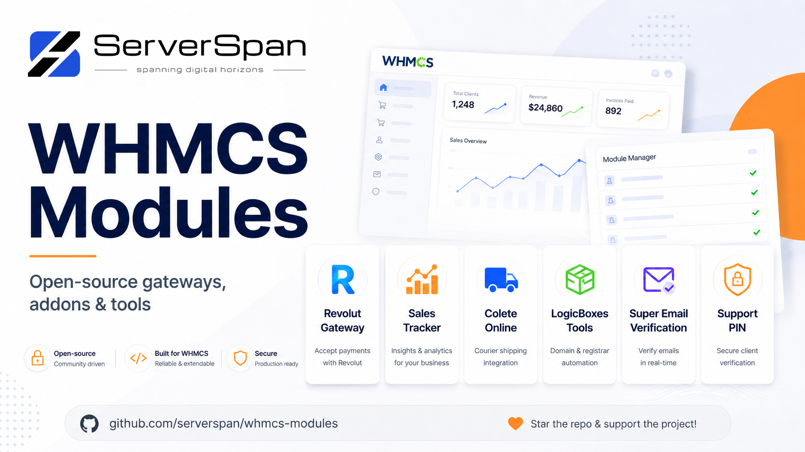

<a href="https://github.com/serverspan/whmcs-modules"></a>

# ServerSpan WHMCS Modules

[](https://github.com/serverspan/whmcs-modules/actions/workflows/ci.yml)

Open-source WHMCS integrations maintained by [ServerSpan](https://www.serverspan.com/en/): payment gateways, operational addons, security tooling, registrar automation, shipping integrations, analytics, and future provisioning modules.

The repository is intentionally source-first: no encoded PHP, no hidden licensing callbacks, no mystery binaries, and no telemetry unless communication with an upstream provider is fundamental to the module itself.

## Module catalog

| Module | Type | Version | Maturity | What it does |
|---|---|---:|---|---|
| [Revolut Gateway](payments/revolut/) | Payment gateway | 1.0.0-beta.1 | Beta | Embedded card checkout, saved payment methods, recurring merchant-initiated charges, refunds, Revolut Pay and verified webhooks. |
| [Sales Tracker](addons/sales-tracker/) | Addon | 1.0.0-beta.1 | Beta | Sales dashboards, agent attribution, product rankings, order trends and custom reporting periods. |
| [Colete Online](addons/colete-online/) | Addon | 1.0.0-beta.1 | Beta | Courier quotes, shipment creation, AWB/label handling, COD/options and tracking from WHMCS orders. |
| [LogicBoxes Tools](addons/logicboxes-tools/) | Addon | 1.0.0-beta.1 | Beta | Multi-account LogicBoxes/ResellerClub customer, domain, pricing, promo, transfer, SSO and automation toolkit with dry-run jobs and rollback data. |
| [Super Email Verification](addons/supermailverify/) | Addon | 1.0.0 | Beta | Email verification, disposable-domain blocking, duplicate-address defenses, email/IP bans, captcha gates, reminders and cleanup automation. |
| [Support PIN](addons/supportpin/) | Addon | 1.0.0 | Beta | Client-generated support PINs, staff verification, temporary access grants, rate limiting and audit logging. |

See the [full module catalog](docs/MODULE-CATALOG.md) for install paths, schema/cron behavior, upstream dependencies and validation notes.

> **Production note:** version numbers and passing static tests do not automatically mean a module is production-validated. Each module documents the provider sandbox/live validation still required before enabling financially or operationally sensitive automation.

## Repository layout

```text
payments/          Payment gateways
addons/            Admin/client-area addons and operational automation
servers/           Provisioning/lifecycle modules for infrastructure
docs/              Repository standards and module catalog
scripts/           Packaging helpers
.github/           CI, issue forms and contribution automation
```

New modules should follow the canonical release layout documented in [`docs/MODULE-STANDARDS.md`](docs/MODULE-STANDARDS.md).

## Quick start

Run every repository check:

```bash
make test
```

Build every distributable module:

```bash
make package-all
```

Or package one module:

```bash
make package-revolut
make package-sales-tracker
make package-colete-online
make package-logicboxes-tools
make package-supermailverify
make package-supportpin
```

Generated ZIP files and SHA-256 files are written to `dist/` and are intentionally excluded from Git.

## Design principles

- **Readable source.** Operators must be able to audit what runs inside their billing system.
- **No secret collection.** API keys, customer data, billing data and infrastructure credentials are not sent to ServerSpan.
- **Safe writes.** Financial and destructive actions should be idempotent, previewable or explicitly confirmed where the upstream workflow permits it.
- **No raw payment data.** Payment integrations should keep PAN/CVV outside WHMCS whenever hosted fields or provider tokenisation exist.
- **Secure hooks and callbacks.** CSRF, webhook authentication, replay protection and repeated include/callback safety are treated as first-class concerns.
- **Explicit compatibility.** README files separate PHP/static compatibility from real WHMCS/provider validation.
- **Safe logging.** Secrets, raw tokens, card data and passwords must never be intentionally written to logs.
- **Reproducible releases.** Install archives are generated from source and do not live in the main tree.

## Security and support

Do not post API credentials, payment tokens, card data, WHMCS administrator credentials, database dumps or unredacted logs in public issues.

- Bugs and feature requests: [GitHub Issues](https://github.com/serverspan/whmcs-modules/issues)
- Security reports: [`SECURITY.md`](SECURITY.md)
- Contribution requirements: [`CONTRIBUTING.md`](CONTRIBUTING.md)
- Module standards: [`docs/MODULE-STANDARDS.md`](docs/MODULE-STANDARDS.md)

## Why ServerSpan publishes this

WHMCS remains deeply embedded in hosting operations, while a surprising amount of its third-party ecosystem is still encoded, abandoned, license-server dependent or difficult to audit. This repository is meant to provide boring, inspectable integrations that operators can actually own.

If you operate a hosting business around WHMCS, these ServerSpan services are directly relevant:

- [WHMCS-compatible reseller hosting](https://www.serverspan.com/en/webreseller)
- [KVM & LXC VPS hosting](https://www.serverspan.com/en/virtual-servers)
- [DirectAdmin web hosting](https://www.serverspan.com/en/webhosting)
- [Free DevOps & sysadmin tools](https://www.serverspan.com/en/tools/index)
- [How to start a reseller hosting business](https://www.serverspan.com/en/blog/how-to-start-a-reseller-hosting-business-in-2026-complete-step-by-step-playbook)

## Need a VPS for WHMCS?

Want a clean VPS to install WHMCS, test these modules, or run your billing stack?

**Get 15% off ServerSpan KVM and LXC VPS plans - recurring for as long as you keep the service.**

**Promo code: `WHMCS15`**

[Deploy a ServerSpan VPS](https://www.serverspan.com/en/virtual-servers)

- Applies to new VPS orders.
- The 15% discount is recurring on renewals, not just the first invoice.
- WHMCS itself is not included. Bring your own WHMCS license.
- These modules do not require ServerSpan hosting; using ServerSpan is entirely optional.

The modules remain free and open source. Using ServerSpan simply helps fund continued development, testing, and maintenance of the project.

## License

MIT. See [`LICENSE`](LICENSE).

WHMCS, Revolut, Colete-Online, ResellerClub, LogicBoxes, DirectAdmin, cPanel and other product names are trademarks of their respective owners. This repository is not endorsed by those vendors unless explicitly stated for a specific module.
